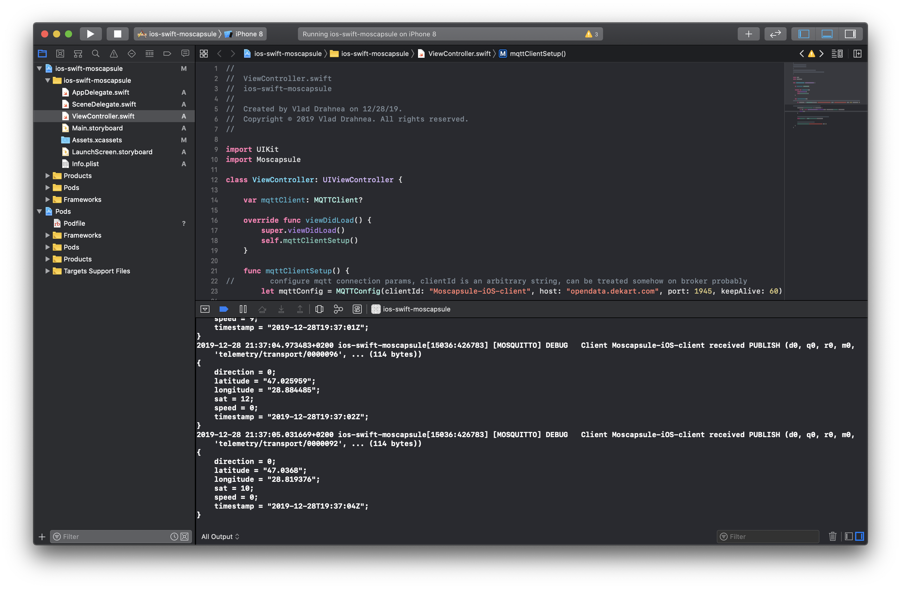

# Exemplu de conexiune la MQTT broker cu Swift, pe platforma iOS, cu ajutorul MQTT client-ului Moscapsule

0. Din păcate, la moment, și puțin probabil situația să se schimbe, dezvoltarea aplicațiilor pentru platformele Apple este posibilă doar de pe macOD cu xCode. În caz că nu vreți să cumpărați mac este opțiunea cu [hackintosh](https://www.tonymacx86.com/buyersguide/building-a-customac-hackintosh-the-ultimate-buyers-guide/).

1. Pentru bun început avem nevoie să instalăm dependețele. În cazul nostru sunt două: Moscapsule, librăria MQTT pentru iOS; și librăria OpenSSL care e o dependență a Moscapsule și permite lucrul cu servere protejate prin criptare. 
```
...
  use_frameworks!

  pod 'Moscapsule', :git => 'https://github.com/flightonary/Moscapsule.git'
  pod 'OpenSSL-Universal', '~> 1.0.1.20'
...
```
Pentru gestionarea lor noi folosim managerul Cocoa Pods. Din fericire el face multe lucruri automat și totul ce se cere de la noi e să scriem comanda în consolă `$pod install`:


2. Deschidem proiectul de tip xcworkspace din consolă `$open ios-swift-moscapsule.xworkspace`, sau cu dublu clic din interfața grafică.

3. Compilăm și lansăm proiectul în simulator (dacă nu dispunem de dispozitiv cu iOS) CMD+R. Și vedem în Debug Area, care se află jos, pe panelul Console mesajele de la MQTT broker la topic-ul transport:


# Informații utile
- [Moscapsule, iOS MQTT library](https://github.com/flightonary/Moscapsule)
- [tonymacx86, how to build a hackintosh](https://www.tonymacx86.com/buyersguide/building-a-customac-hackintosh-the-ultimate-buyers-guide/)
- [Managerul de dependențe Cocoa Pods](https://cocoapods.org/)
